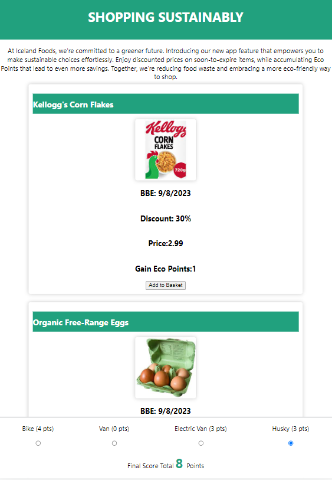

Welcome to our App introducing the Shopping Sustainably feature by Iceland Foods. Our mission was clear: create an eco-friendly solution that empowers customers to make sustainable choices while saving money.

The heart of this feature lies in encouraging users to select products that are nearing their sell-by date. Not only does this allow them to enjoy significant cost savings, but it also aligns with our commitment to reducing food waste and treading more lightly on our planet.

Collaboration has been key. We utilized Figjam and Figma for wireframing, dividing into two focused teams. Team one meticulously designed the frontend – the header, mission statement, and product tiles. These tiles represent an array of products, each encouraging environmentally-conscious decisions. They're a testament to our ethos: a symbiotic blend of financial benefits and planet-friendly shopping. Meanwhile, team two revolutionized delivery options, where selecting greener choices rewards customers with additional Eco Points.

The Shopping Sustainably app feature encapsulates Iceland Foods' dedication to customers and the environment. Thank you for joining us on this journey towards a more sustainable future.

Links:

FigJam Board: https://www.figma.com/file/xoh55KauCkXyYysrgB9jRw/ICELAND-HACKATHON?type=whiteboard&node-id=0%3A1&t=aVLeL7CVNpKYkQFK-1

Figma Wireframes: https://www.figma.com/file/OkvdRc9FRXR9kNfFPatAaQ/ICELAND-HACKATHON?type=design&mode=design&t=aVLeL7CVNpKYkQFK-1
